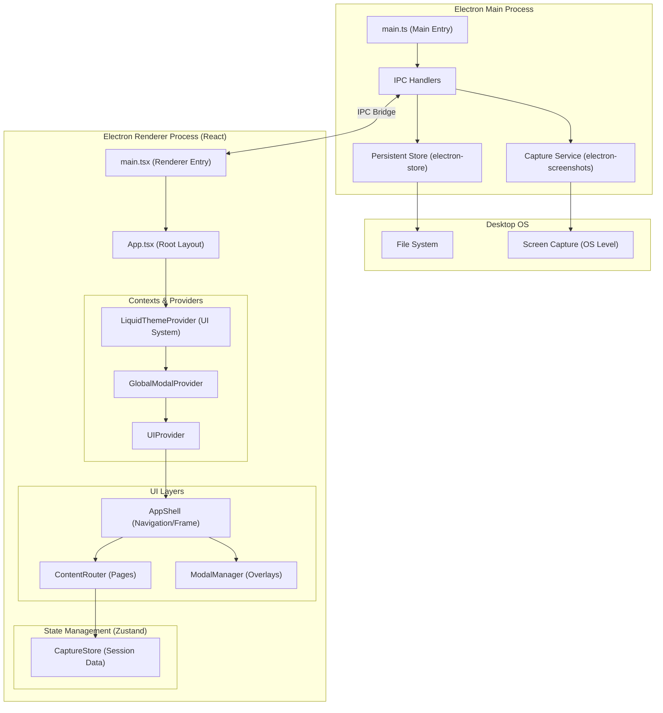

# Arquitectura de SnapProof

Este documento describe la estructura técnica y el flujo de datos del proyecto SnapProof.

## Diagrama de Arquitectura (C4 Simplified)

---

## Descripción de Componentes

### 1. Proceso Principal (Main Process)
- **`main.ts`**: Punto de entrada de la aplicación Electron. Gestiona el ciclo de vida de la ventana y los eventos del sistema.
- **IPC Handlers**: Actúan como puente de comunicación segura entre la interfaz (React) y las capacidades del sistema operativo.
- **Capture Service**: Utiliza `electron-screenshots` para permitir al usuario seleccionar áreas de la pantalla y tomarlas como evidencia.
- **Persistent Store**: Implementado con `electron-store`, guarda configuraciones del usuario y metadatos de las capturas localmente.

### 2. Proceso de Renderizado (Renderer Process)
- **Liquid Glass Design System**: Un motor de temas personalizado inspirado en el diseño de Apple (2026), que utiliza variables CSS semánticas y efectos de desenfoque dinámico.
- **Zustand Stores**: Gestionan el estado global de la aplicación, como la lista de capturas activas (`CaptureStore`) y el historial de acciones.
- **Content Router**: Maneja la navegación interna entre vistas como "Recents", "Flows" e "History".
- **Global Modal Provider**: Un sistema centralizado para disparar modales complejos (Wizard de reportes, Editor de imágenes) sin ensuciar el árbol de componentes.

---

## Resumen Tecnológico

SnapProof es una aplicación de escritorio moderna construida sobre **Electron 39**, utilizando **Tailwind CSS** para el estilizado y **Framer Motion** para animaciones fluidas de alta fidelidad.

### Tecnologías Core:
- **Framework UI**: [React 19](https://react.dev/) + [TypeScript](https://www.typescriptlang.org/).
- **Bundler**: [Vite](https://vitejs.dev/) para un desarrollo ultrarrápido.
- **Gestión de Estado**: [Zustand](https://zustand-demo.pmnd.rs/) por su ligereza y alto rendimiento.
- **Diseño**: Sistema **Liquid Glass** (Custom CSS) + **Lucide React** para iconografía.
- **Canvas/Edición**: [Fabric.js](http://fabricjs.com/) para la manipulación y anotación de imágenes.
- **Generación de Reportes**: [jsPDF](https://rawgit.com/MrRio/jsPDF/master/docs/index.html) (PDF) y [docx](https://docx.js.org/) (Word).
- **Utilidades**: 
    - **SweetAlert2** para diálogos interactivos.
    - **Date-fns** para manejo de fechas.
    - **Zod** para validación de esquemas de datos.
